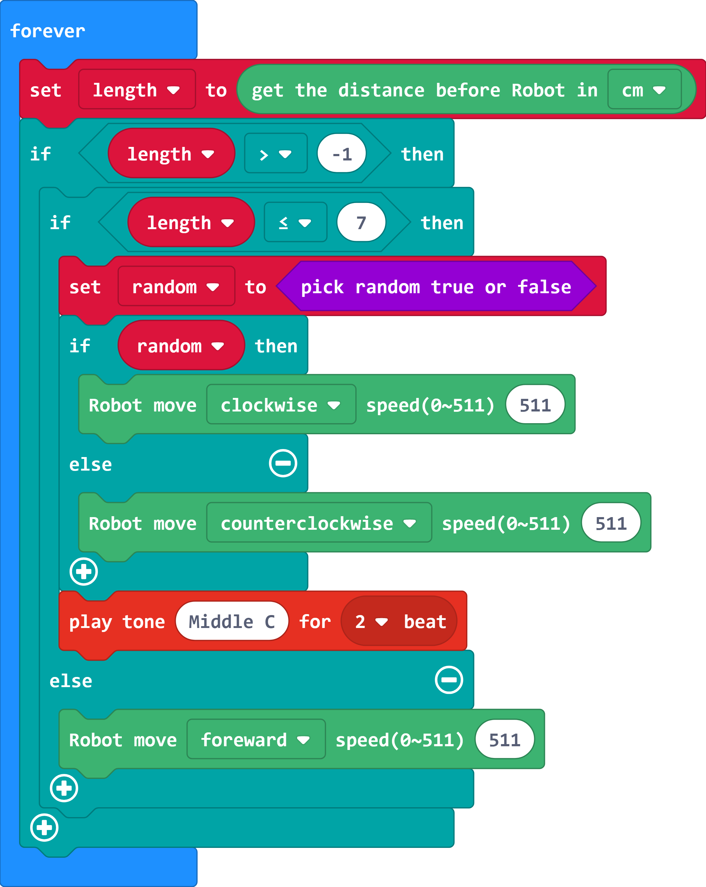
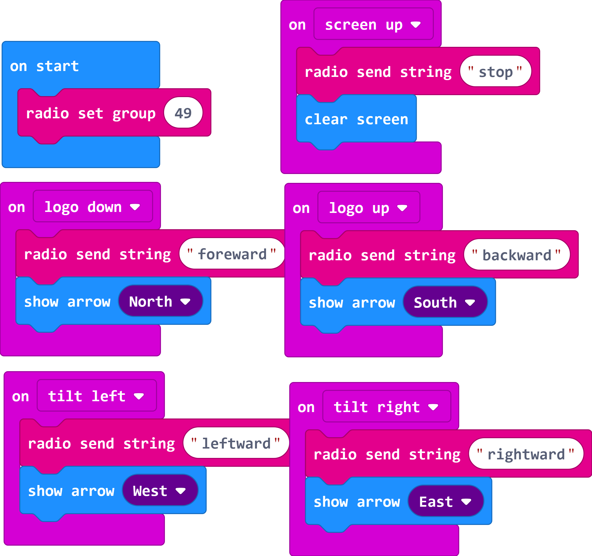
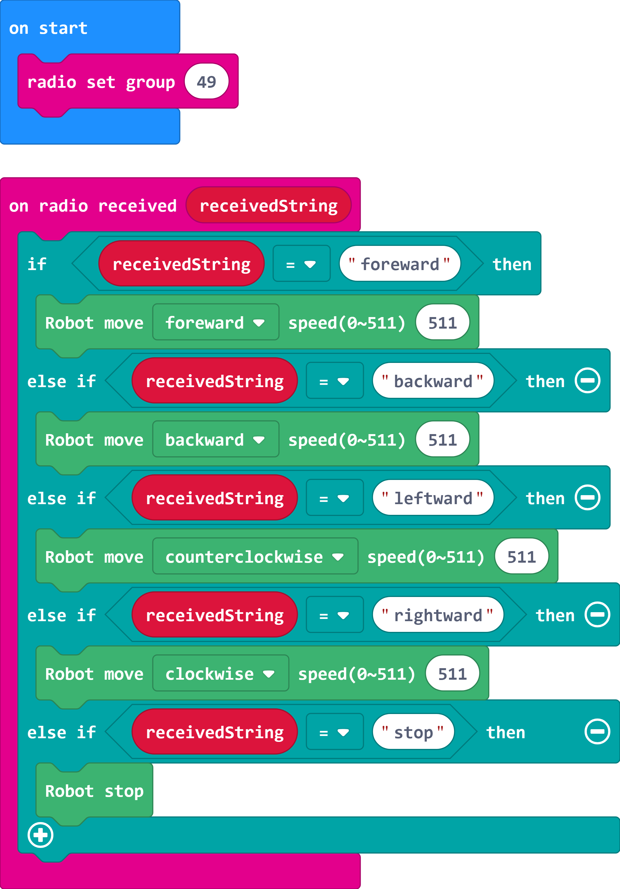

# Tamiya_71201

這是專為Tamiya田宮Robot71201提供的控制積木\
This is the extension for Tamiya 71201 microcomputer robot

## Author
Liou Zheng-Ji\
劉正吉\
[my page, https://sites.google.com/jes.mlc.edu.tw/ljj/](https://sites.google.com/jes.mlc.edu.tw/ljj/)

## Description
Tamiya 71201 is a robot for micro:bit that manufactured from YAMIYA, but Tamiya doesn't make the extension for the robot. So, I made it. 

## Video1: Obstacle avoidance mode 
[](https://www.youtube.com/watch?v=jVTZ3zXjj3U)

## Example1: Obstacle avoidance mode 


## Video2: Remote control mode 
[](https://www.youtube.com/watch?v=qcyHoROeya8)

## Example2: Remote control mode
The code of controller\

 \
The code of Robot\



## License

* MIT

## Supported targets

* for PXT/microbit
(The metadata above is needed for package search.)

```package
Tamiya_71201=github:lioujj/pxt-Tamiya_71201
```